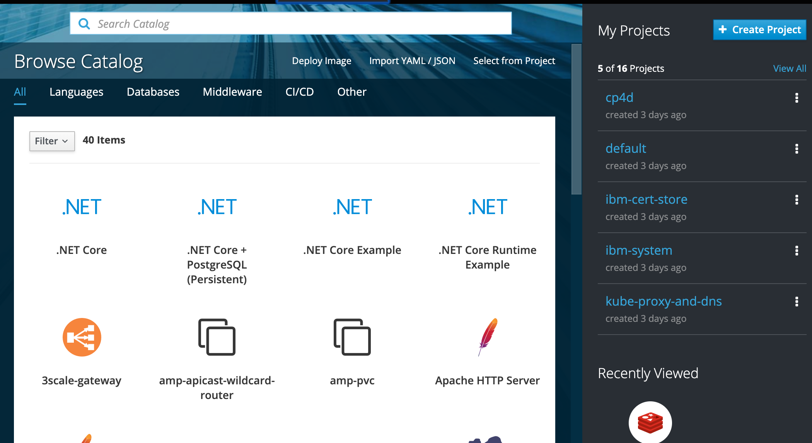
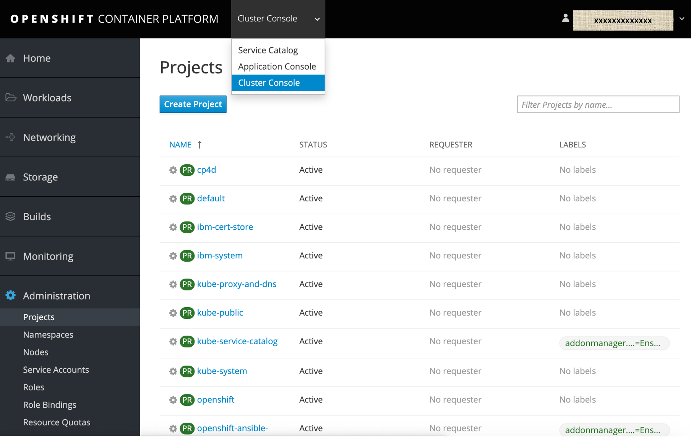
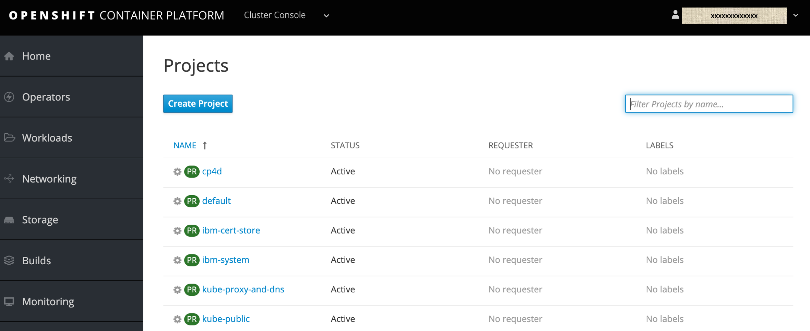

# Manually installing the Open Data Hub 
This procedure describes how to install the Open Data Hub operator into your project namespace on OpenShift 3.11 
and is based on procedures

## Prerequisites
1.	Access to OpenShift using an account with **cluster-admin** privileges available. You will need the 
    **cluster-admin** privileges to create the **OpenDataHub** custom resource definition, and to apply the 
    **anyuid** security context constraint (SCC) for the Ceph container.
2.	A terminal shell with the OpenShift client command **oc** availabe.
3.	A copy of the files in this repository available in your terminal shell.
1.  A working knowledge of Kubernetes.
1.  A target cluster with access to the internet and the ability to pull from public container registries.

## Installing the Operator Lifecycle Manager (OLM)

The Operator Lifecycle Manager (OLM) is a tool to help manage the Operators running on your cluster.

If you are running OpenShift 3.11 determkne if the OLM is already installed. Note the OLM is installed in OpenShift version 4.x by default

1. Log onto OpenShift Cluster 


1. Determine if you already have OLM installed by accessing the **Cluster Console**
If you see Operator in list on left you can skip this section. 



1. If not run the following command to install the OLM:

```

# curl -sL https://github.com/operator-framework/operator-lifecycle-manager/releases/download/0.11.0/install.sh | bash -s 0.11.0

```

1. Verify that OLM has een successfully installed into OpenShift Cluster by access Cluster Console again.



## References
1.	operator-lifecycle-manager, https://github.com/operator-framework/operator-lifecycle-manager , A management framework for extending Kubernetes with Operators
2.	Opendatahub-operator, https://gitlab.com/opendatahub/opendatahub-operator/-/tree/master
3.	Manually Install OpenData Hub, https://gitlab.com/opendatahub/opendatahub-operator/-/blob/master/docs/manual-installation.adoc


## Manually installing the Open Data Hub 
This procedure describes how to install the Open Data Hub operator into your project namespace on OpenShift 3.11

### Prerequisites
1.	Access to OpenShift using an account with cluster-admin privileges available. You will need the cluster-admin privileges to create the OpenDataHub custom resource definition, and to apply the anyuid security context constraint (SCC) for the Ceph container.
2.	A terminal shell with the OpenShift client command oc availabe.
3.	A copy of the files in this repository available in your terminal shell.


### Procedure
1.	Change directory to the root of your copy of this repository.
2.	Add the OpenDataHub custom resource definition to OpenShift by entering the following command.
```
# oc apply -f deploy/crds/opendatahub_v1alpha1_opendatahub_crd.yaml
```
3.	If installing Seldon, add the SeldonDeployment custom resource definition to OpenShift by entering the following command.
```
# oc apply -f deploy/crds/seldon-deployment-crd.json
```
4.	If installing Argo, add the Workflow custom resource definition to OpenShift by entering the following command.
```
# oc apply -f deploy/crds/argo-crd.yaml
```
5.	Configure role-based access control (RBAC) for the operator by entering the following commands.
```
# oc apply -f deploy/service_account.yaml
# oc apply -f deploy/role.yaml
# oc apply -f deploy/role_binding.yaml
```
8.	Deploy the Open Data Hub operator by entering the following command.
```
# oc apply -f deploy/operator.yaml
```
9.	Copy the default Open Data Hub custom resource manifest. Copying this file will allow you to make changes for your environment without disturbing the original file.
```
# cp deploy/crds/opendatahub_v1alpha1_opendatahub_cr.yaml my_environment_cr.yaml
```
10.	Deploy the Open Data Hub using the custom resource manifest for your environment by entering the following command.
```
#  oc apply -f my_environment_cr.yaml
```
11.	FOR A CEPH NANO DEPLOYMENT ONLY IN OCP3.11
The OpenShift user requires a security context to deploy the Ceph container. Not having this context will cause the Ceph pod initialization to fail with the message mkdir: cannot create directory '/var/lib/ceph': Permission denied. To prevent this failure, enter the following command (replacing <NAMESPACE> with your project name).
```
oc adm policy add-scc-to-user anyuid system:serviceaccount:<NAMESPACE>:default
```


## Verify 

1.	From the OpenShift console, log in as a user with cluster-admin privileges. 
 

2.	Select the Cluster Console
 

3.	Create a new namespace for your installation of Open Data Hub (example “odh”)

 

Find Open Data Hub in the OperatorHub catalog.
1.	Select the new namespace if not already selected.
2.	Under Operators, select OperatorHub for a list of community operators.
3.	Filter for Open Data Hub or look under Big Data for the icon for Open Data Hub.


